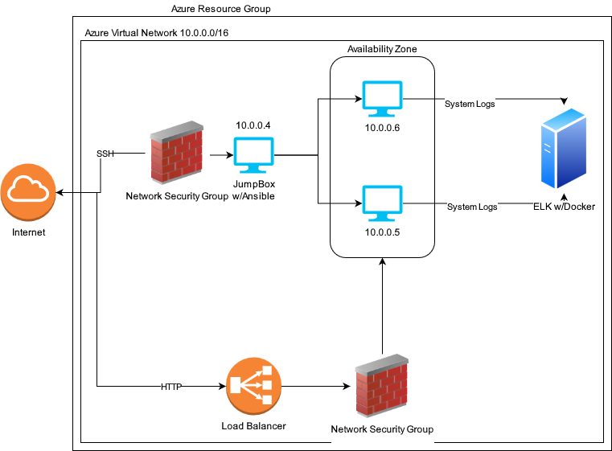

## Automated ELK Stack Deployment

The files in this repository were used to configure the network depicted below.

These files have been tested and used to generate a live ELK deployment on Azure. They can be used to either recreate the entire deployment pictured above. Alternatively, select portions of the playbook file may be used to install only certain pieces of it, such as Filebeat.

This document contains the following details:
- Description of the Topology
- Access Policies
- ELK Configuration
  - Beats in Use
  - Machines Being Monitored
- How to Use the Ansible Build

### Description of the Topology

The main purpose of this network is to expose a load-balanced and monitored instance of DVWA, the D*mn Vulnerable Web Application.

Load balancing ensures that the application will be highly available, in addition to restricting access to the network.

Integrating an ELK server allows users to easily monitor the vulnerable VMs for changes to files, as well as system metrics.

The configuration details of each machine may be found below.
_Note: Use the [Markdown Table Generator](http://www.tablesgenerator.com/markdown_tables) to add/remove values from the table_.

| Name       | Function                      | IP Address | Operating System |
| ---------- | ----------------------------- | ---------- | ---------------- |
| Jump Box   | Gateway                       | 10.0.0.4   | Linux            |
| Web-1      | Web Server                    | 10.0.0.5   | Linux            |
| Web-2      | Web Server                    | 10.0.0.6   | Linux            |
| Elk Server | Centralize logs & system info | 10.1.0.6   | Linux            |

### Access Policies

The machines on the internal network are not exposed to the public Internet. 

Only the Jump Box machine can accept connections from the Internet. Access to this machine is only allowed from whitelisted IP addresses, such as my own home IP to connect from.

Machines within the network can only be accessed by the Jump Box.

A summary of the access policies in place can be found in the table below.

| Name     | Publicly Accessible | Allowed IP Addresses |
| -------- | ------------------- | -------------------- |
| Jump Box | Yes                 | 170.4.237.43         |
| Web-1    | No                  | Jump Box             |
| Web-2    | No                  | Jump Box             |

### Elk Configuration

Ansible was used to automate configuration of the ELK machine. No configuration was performed manually, which is advantageous because it allows for quick restarting of the ELK instance, and makes the machine itself matter less, since a new one can be created if need be.

The playbook implements the following tasks:
- Installs necessary packages (docker, pip).
- Allows the container to use the necessary amounts of memory.
- Downloads the docker container for the ELK stack, launches it, and opens the necessary ports.
- Enables the docker service on boot.

The following screenshot displays the result of running `docker ps` after successfully configuring the ELK instance.

### Target Machines & Beats
This ELK server is configured to monitor the following machines:
- 10.0.0.5 (Web-1)
- 10.0.0.6 (Web-2)

We have installed the following Beats on these machines:
- Filebeat, which monitors logs and aggregates them, sending them off to the ELK server for visualization.

### Using the Playbook
In order to use the playbook, you will need to have an Ansible control node already configured. Assuming you have such a control node provisioned: 

SSH into the control node and follow the steps below:
- Copy the `elk-playbook.yml` file to `/etc/ansible/roles`.
- Update the `/etc/ansible/hosts` file to include the IP address of the ELK server under its own group.
- Run the playbook, and navigate to `http://[IP address of your ELK server]:5601/app/kibana`to check that the installation worked as expected.
